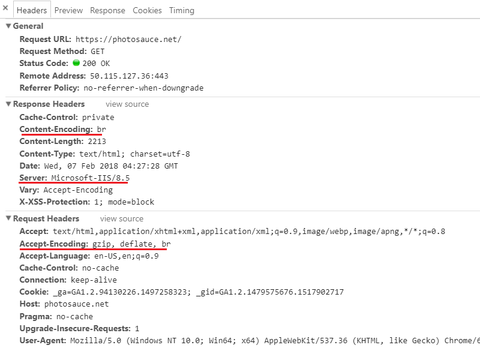
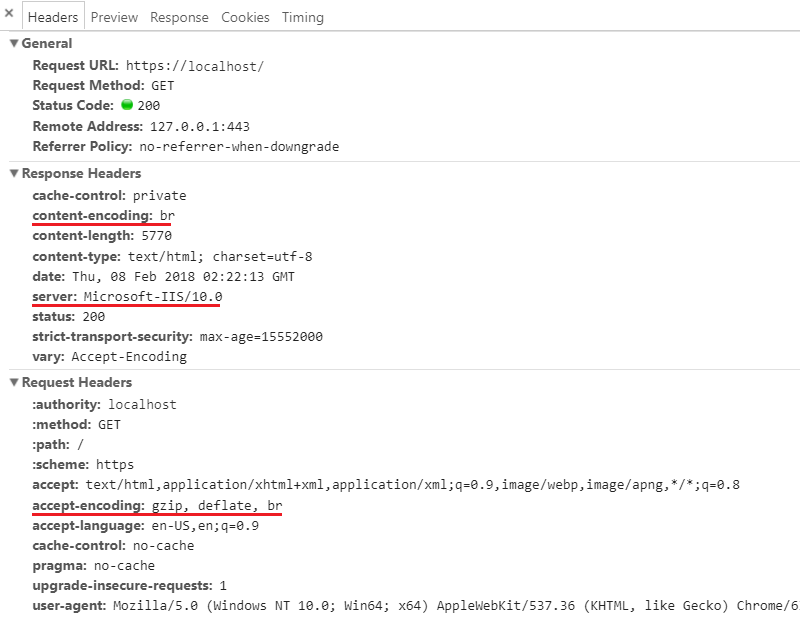

<p align="center"><a href="https://github.com/saucecontrol/Brotli-IIS/releases"></a></p>
<p align="center"><a href="https://github.com/saucecontrol/Brotli-IIS/releases"></a> <a href="https://github.com/saucecontrol/Brotli-IIS/releases"></a></p>

---
**Note**: After this project was created, Microsoft [released their own](https://docs.microsoft.com/en-us/iis/extensions/iis-compression/iis-compression-overview) new compression plugin for Brotli and even [borrowed my workaround](https://docs.microsoft.com/en-us/iis/extensions/iis-compression/using-iis-compression#before-iis-100-version-1803) for `Accept-Encoding` priority.  You may wish to use that plugin instead.  However, this project uses a newer version of the Brotli encoder which includes some [performance improvements](https://github.com/google/brotli/pull/636) that make it 5-15% faster than the version Microsoft is using.

Brotli IIS Compression Scheme Plugin
====================================

Brotli is a [new-ish](https://opensource.googleblog.com/2015/09/introducing-brotli-new-compression.html) open-sourced compression algorithm specifically designed for HTTP content encoding.  The algorithm and reference encoder/decoder libraries were [created by Google](https://github.com/google/brotli).

Brotli offers significantly [better compression than gzip](https://samsaffron.com/archive/2016/06/15/the-current-state-of-brotli-compression) with very little additional compression cost and almost no additional decompression cost.

This plugin is a very thin wrapper around Google's Brotli encoding library.  There is no license management code, no automagic configuration, no unnecessary processing.  This plugin contains only what is absolutely necessary to cleanly and reliably integrate Google's Brotli encoder with IIS's built-in Static and Dynamic Compression Modules.

Of course, that means you have to configure it yourself.  But a proper HTTP compression design requires that you know what you're doing anyway, so this should not be a problem.  If you're new to this, you may find the following links useful for learning about IIS compression and the configuration thereof.

* [Built-in GZip/Deflate Compression on IIS 7.x](https://weblog.west-wind.com/posts/2011/May/05/Builtin-GZipDeflate-Compression-on-IIS-7x)
* [IIS 7 Compression. Good? Bad? How much?](https://weblogs.asp.net/owscott/iis-7-compression-good-bad-how-much)
* [Changes to compression in IIS7](http://www.ksingla.net/2006/06/changes_to_compression_in_iis7/)

Very little has changed since IIS 7 was released, but here's one more article highlighting some improvements to dynamic compression and compression config in IIS 10

* [IIS Dynamic Compression and new Dynamic Compression features in IIS 10](https://blogs.msdn.microsoft.com/friis/2017/09/05/iis-dynamic-compression-and-new-dynamic-compression-features-in-iis-10/)

Features
--------

* Integrates with the built-in IIS Static and Dynamic Compression Modules.
* Uses the latest version of Google's Brotli encoder (v1.0.9).

Requirements
------------

IIS 7 or later (Windows Vista/Windows Server 2008). You must have admin permissions to modify the root `applicationHost.config` file.

Installation
------------

The Brotli IIS Compression Scheme Plugin is packaged as a single DLL file per platform architecture, with no external dependencies.  The simplest way to install it is to copy it to your `inetsrv` folder, alongside the built-in `gzip.dll`.  This allows configuration for Brotli to mirror the built-in schemes and allows for easy support of both 64-bit and 32-bit Application Pools.

Binaries are available on the [releases page](https://github.com/saucecontrol/BrotliIIS/releases).  A sample installation script is included in the .zip file.

The Compression Scheme must be registered in the `applicationHost.config` file.  You can do this manually or with appcmd.exe or IIS Manager.  Final configuration will look something like this:

```
<httpCompression directory="%SystemDrive%\inetpub\temp\IIS Temporary Compressed Files">
    <scheme name="br" dll="%windir%\system32\inetsrv\brotli.dll" dynamicCompressionLevel="5" staticCompressionLevel="11" />
    <scheme name="gzip" dll="%windir%\system32\inetsrv\gzip.dll" dynamicCompressionLevel="4" staticCompressionLevel="9" />
    <staticTypes>
        <add mimeType="text/*" enabled="true" />
         ...
    </staticTypes>
    <dynamicTypes>
        <add mimeType="text/*" enabled="true" />
        ...
    </dynamicTypes>
</httpCompression>
```

Note that the name `br` shown above is important.  This name must match the `Accept-Encoding` header value sent by the client and will be returned to the client in the `Content-Encoding` header.  `br` is the [official](https://www.iana.org/assignments/http-parameters/http-parameters.xhtml#content-coding) designator for Brotli.

Note also that if you need to support 32-bit Application Pools on 64-bit IIS, you will need to deploy the x64 version of the DLL to `%windir%\system32\inetsrv` and the x86 DLL to `%windir%\syswow64\inetsrv`.  The WoW64 subsystem will automatically load the correct platform version of the DLL if its path is listed under `system32` in the `applicationHost.config`, just as it does with `gzip.dll`.

Configuration
-------------

The only configuration accepted by the plugin is the compression level (or 'quality' in Brotli terms) to use.  This value is configured separately for the IIS Static and Dynamic Compression Modules as demonstrated in the sample config above.

Brotli accepts quality values from `0` to `11`. Configured values outside that range will cause the compression DLL to raise an error during processing.

Be aware that the default values for compression level in IIS are `0` for dynamic content and `7` for static content.  These values are based on the `0` to `9` scale used by `gzip` and `deflate` and aren't normally ideal settings anyway.  The values in the sample above represent a good starting point for most modern servers.

Browser Support
---------------

Since the end of 2017, Brotli has been supported in [all modern browsers](https://caniuse.com/#feat=brotli).

There are however, some gotchas related to the way the browser support is implemented.

### HTTPS is Required

Current browsers will only request and accept Brotli encoding over HTTPS.  Due to some poorly-behaved intermediate software/devices (proxies, caches, etc) in the wild, the Chrome dev team [decided](https://bugs.chromium.org/p/chromium/issues/detail?id=452335#c87) to only advertise Brotli support over HTTPS so that these poorly-behaved intermediaries couldn't mangle Brotli-encoded responses.  Other vendors followed suit.

If you aren't using HTTPS, you can't use Brotli.  Thankfully, with [Let's Encrypt](https://github.com/Lone-Coder/letsencrypt-win-simple), HTTPS is now free and easy to set up.  Just do it.

### Brotli is Low-Priority on Older IIS Versions

Current browsers advertise Brotli support *after* `gzip` and `deflate` in the `Accept-Encoding` header.  Typical headers will look like: `Accept-Encoding: gzip, deflate, br`.  This is probably also for reasons related to existing poorly-behaved Internet software.

The [HTTP RFC](https://tools.ietf.org/html/rfc7231#section-5.3.4) gives no specific guidance on how to choose from many `Accept-Encoding` values with the same priority, so it would be acceptable to return `br` content to those clients, but some versions of IIS choose the first one (left to right) that matches one of the configured compression schemes. This means they won't choose `br` if either `gzip` or `deflate` compression is also enabled.

This issue has been resolved in IIS 10 version 1803 and newer.  On IIS 10, the priority for response encoding is set by the order of the `scheme` elements under `httpCompression`.  If you list `br` before `gzip`, it will be given priority regardless of the order in the request header.

On older versions of IIS, you have two options:

1) Disable `gzip` and `deflate` on your server so that `br` is the only possible match.  As of early 2021, Brotli is supported by over 95% of browsers worldwide, and that number continues to climb.  Older clients would continue to work with uncompressed responses.
2) Take some action to force IIS to choose `br` when acceptable.  To accomplish this, you can modify the `Accept-Encoding` header value on requests as they enter your IIS pipeline.  The [IIS URL Rewrite Module](https://www.iis.net/downloads/microsoft/url-rewrite) makes this easy.

The `Accept-Encoding` header is represented by the `HTTP_ACCEPT_ENCODING` Server Variable in the IIS pipeline, and you can modify it before it reaches the Compression Module(s).  Here is a sample configuration:

```
<rewrite>
    <allowedServerVariables>
        <add name="HTTP_ACCEPT_ENCODING" />
    </allowedServerVariables>
    <rules>
        <rule name="Prioritize Brotli">
            <match url=".*" />
            <conditions>
                <add input="{HTTP_ACCEPT_ENCODING}" pattern="\bbr(?!;q=0)\b" />
            </conditions>
            <serverVariables>
                <set name="HTTP_ACCEPT_ENCODING" value="br" />
            </serverVariables>
        </rule>
    </rules>
</rewrite>
```

The rule above simply looks for the string `br` (surrounded by word boundaries and not immediately followed by `;q=0`) in the `Accept-Encoding` header and re-writes it to be just plain `br`, giving IIS only one choice.

Note that the default URL Rewrite configuration does not allow modification of the `HTTP_ACCEPT_ENCODING` variable.  The `allowedServerVariables` element overrides that restriction and must be configured in `applicationHost.config`.  The rewrite rule can then be defined at any level in the config hierarchy, although it probably makes sense to make it global.

Note also that URL Rewrite makes requests ineligible for caching in the HTTP.sys kernel-mode cache.  If you wish to take full advantage of kernel-mode caching while using Brotli on older IIS versions, you will need to use option 1) above.

Testing
-------

Once you have configured the Compression Scheme and ensured that Brotli will be chosen by the server, all you have to do is fire up a modern browser (no, IE11 is not modern) and request some text content over HTTPS.

Open your developer tools (F12) network tab and review the request and response headers.  You should see something like this:



It's alive!

Or with HTTP/2 on IIS 10 it should look like this:



Gotta love those lowercase header names!

License
-------

Like [Google's Brotli](https://github.com/google/brotli) software, this Brotli IIS Compression Scheme Plugin is licensed under the [MIT License](https://opensource.org/licenses/MIT).  It is free for all uses, including commercial.

